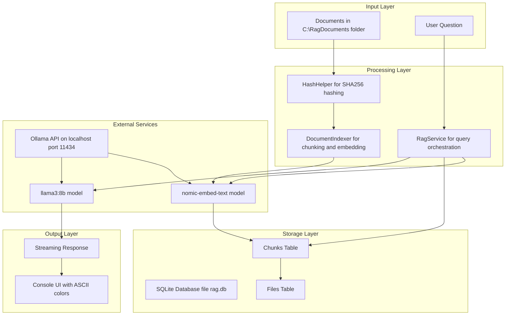
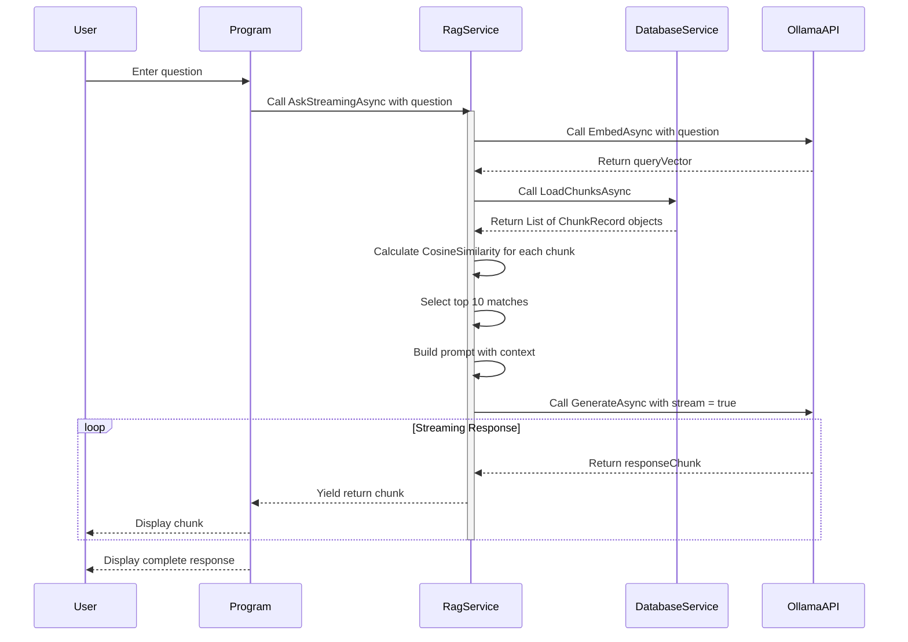
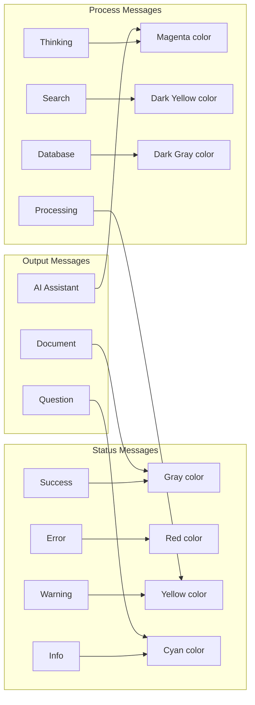
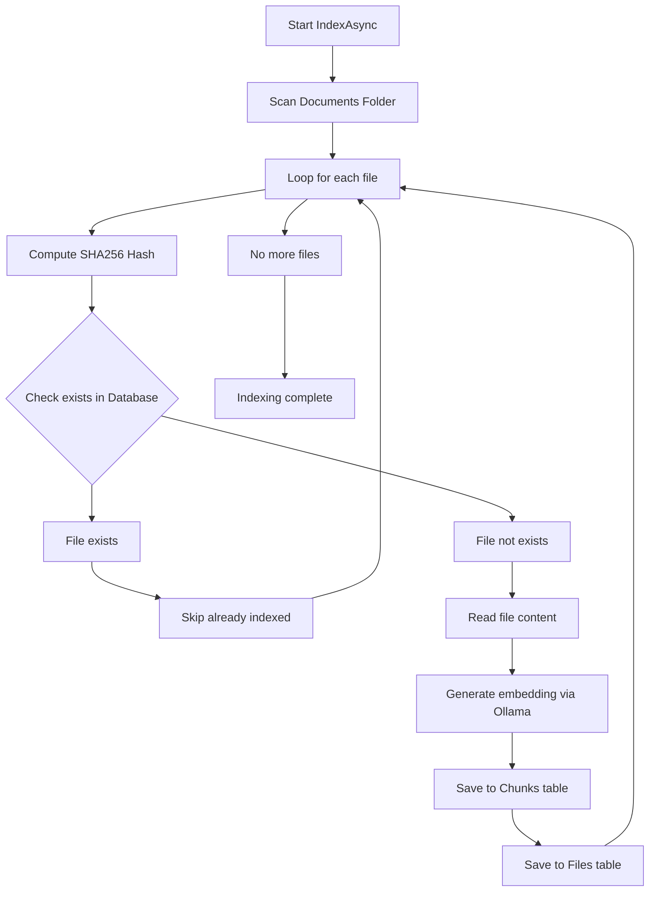
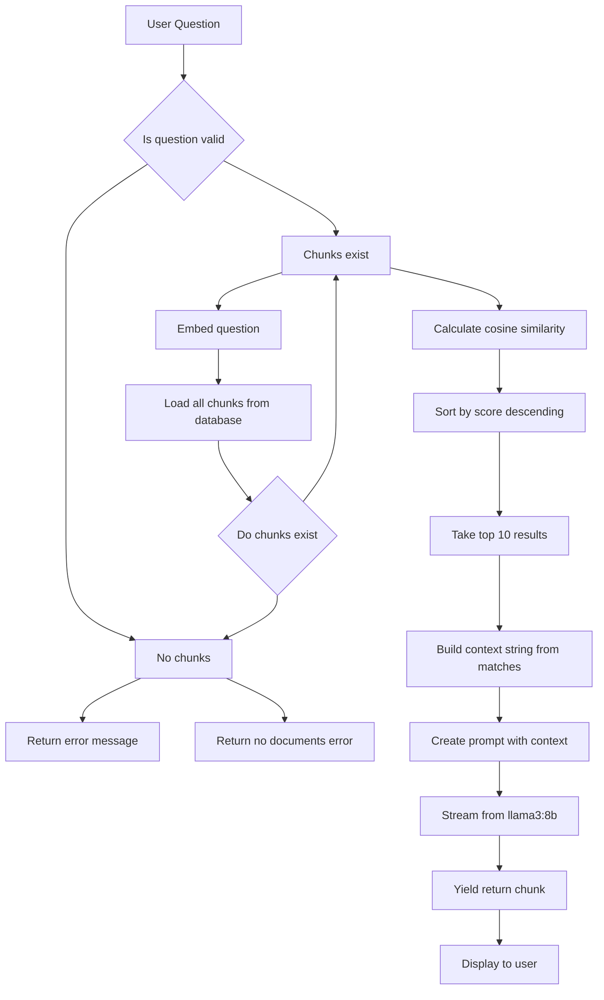
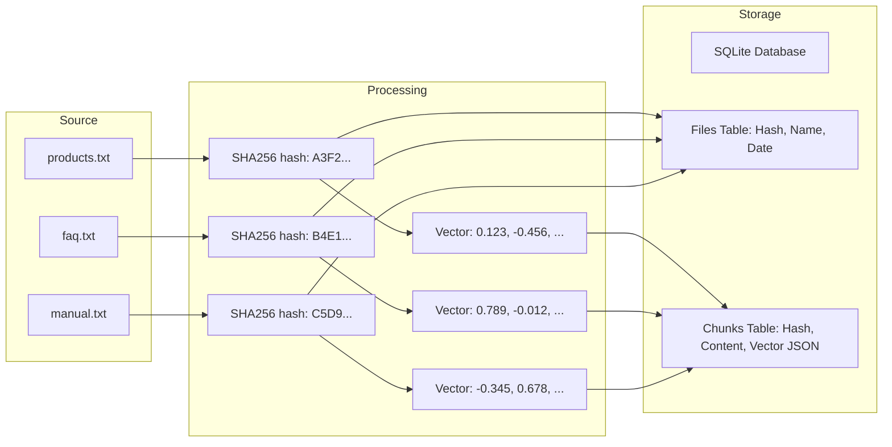
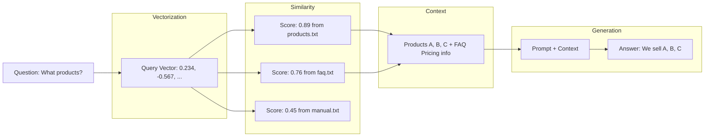
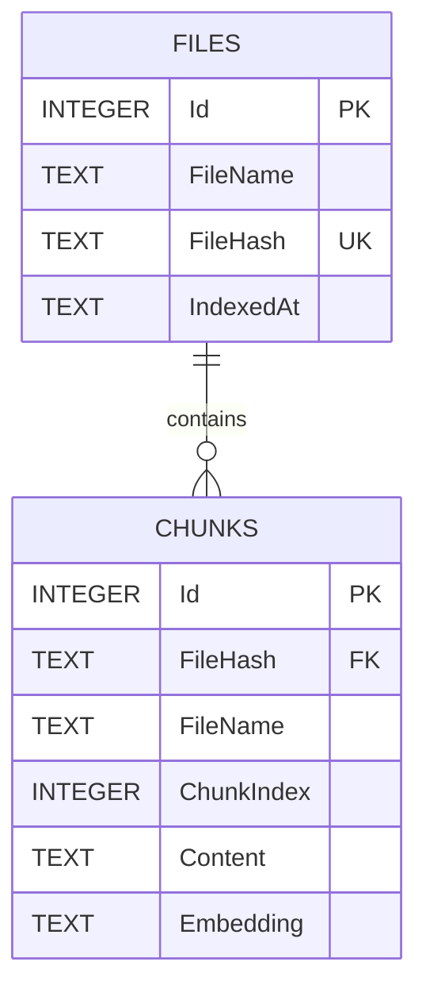
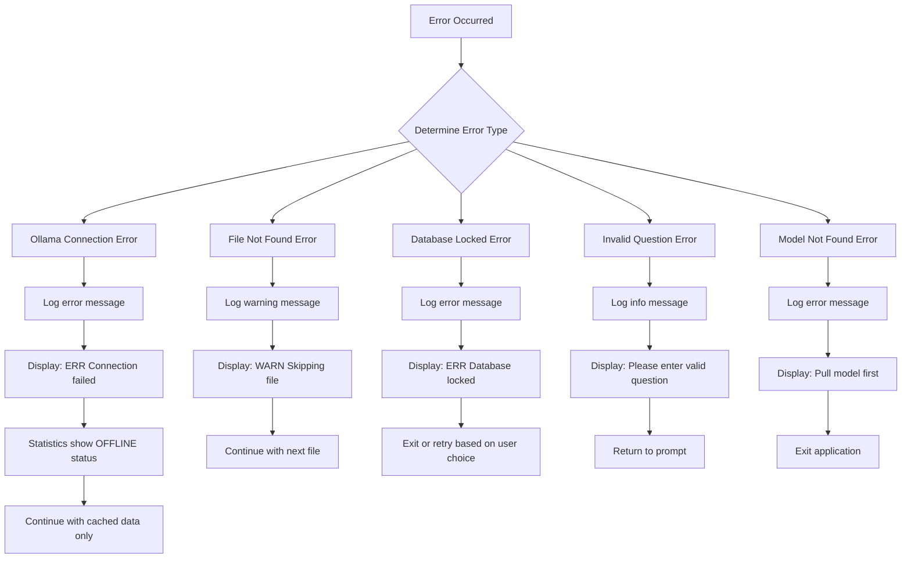
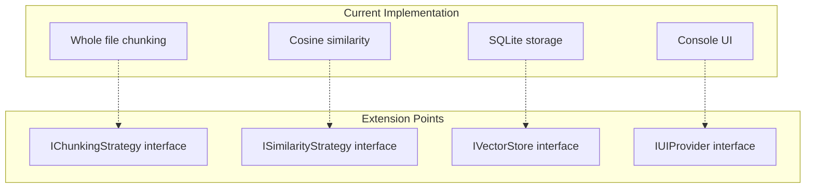

# OllamaSharp RAG SQLite - Technical Documentation

## Technical Architecture Document

**Version**: 1.0  
**Target Framework**: .NET 9.0  
**Language**: C# 13  
**Last Updated**: 2026-06-03

---

## Table of Contents

1. [System Overview](#system-overview)
2. [Architecture](#architecture)
3. [Component Details](#component-details)
4. [Data Flow](#data-flow)
5. [Database Schema](#database-schema)
6. [Algorithms](#algorithms)
7. [API Reference](#api-reference)
8. [Configuration](#configuration)
9. [Performance Characteristics](#performance-characteristics)
10. [Error Handling](#error-handling)
11. [Security Considerations](#security-considerations)
12. [Extensibility Points](#extensibility-points)

---

## System Overview

OllamaSharp RAG SQLite is a local-first Retrieval-Augmented Generation system that combines vector similarity search with large language models. The system eliminates external dependencies by using SQLite for vector storage and Ollama for both embeddings and text generation.

### Key Characteristics

| Property | Value |
|----------|-------|
| Deployment Model | Local-only |
| Vector Storage | SQLite with JSON serialization |
| Search Algorithm | Brute-force Cosine Similarity |
| Embedding Dimension | 768 from nomic-embed-text |
| Context Window | ≈7000 characters |
| Chunking Strategy | Whole-file with pluggable interface |

---

## Architecture

### High-Level Architecture



### Component Interaction Diagram



---

## Component Details

### 1. Program.cs - Entry Point

**Responsibilities**:
- Console lifecycle management
- Command parsing (exit, help, stats)
- ASCII UI rendering
- Streaming output handling

**Key Methods**:

| Method | Description |
|--------|-------------|
| Main | Application entry point initializes services and runs main loop |
| DisplayHelp | Shows available commands to user |
| DisplayStats | Retrieves and displays system statistics |

**Console Encoding**:
```csharp
Console.OutputEncoding = Encoding.ASCII;
Console.InputEncoding = Encoding.ASCII;
```

### 2. ColorHelper.cs - UI Utilities

**Responsibilities**:
- ANSI color management
- ASCII divider generation
- Table formatting
- Animated spinners (thinking and loading states)

**Key Methods**:

| Method | Output Example | Purpose |
|--------|----------------|---------|
| WriteDivider(char, int) | "----" or "====" | Section separation |
| WriteMessage(MessageType, string) | "[OK] Message" | Typed message with color |
| WriteTable(Dictionary) | Formatted table | Statistics display |
| WriteBanner(string[]) | "* Banner *" | Application header display |

**Message Types and Colors**:



### 3. HashHelper.cs - File Hashing

**Responsibilities**:
- SHA256 hash computation
- File integrity verification

**Implementation**:
```csharp
public static string GetFileHash(string filePath)
{
    if (!File.Exists(filePath))
        throw new FileNotFoundException();
    
    using var sha256 = SHA256.Create();
    using var stream = File.OpenRead(filePath);
    byte[] hash = sha256.ComputeHash(stream);
    return Convert.ToHexString(hash);
}
```

### 4. DatabaseService.cs - SQLite Operations

**Responsibilities**:
- Database initialization
- CRUD operations for Files and Chunks tables
- Statistics queries

**Connection String**: `Data Source = rag.db`

**Core Methods**:

| Method | SQL Operation | Purpose |
|--------|---------------|---------|
| InitializeAsync | CREATE TABLE IF NOT EXISTS | Schema setup on first run |
| FileExistsAsync(string hash) | SELECT COUNT(*) | Duplicate detection using hash |
| SaveFileAsync(string, string) | INSERT INTO Files | Track indexed files |
| SaveChunkAsync(ChunkRecord) | INSERT INTO Chunks | Store chunk with vector |
| LoadChunksAsync() | SELECT * FROM Chunks | Load all vectors for search |
| GetChunkCountAsync() | SELECT COUNT(*) | Statistics for display |
| GetDocumentCountAsync() | SELECT COUNT(*) | Statistics for display |

**Vector Storage Strategy**:
```csharp
// Embedding stored as JSON string
command.Parameters.AddWithValue("@embedding", 
    JsonSerializer.Serialize(chunk.Embedding));

// Retrieval deserialization
Embedding = JsonSerializer.Deserialize<float[]>(reader.GetString(5)) 
    ?? Array.Empty<float>();
```

### 5. DocumentIndexer.cs - Indexing Pipeline

**Responsibilities**:
- Document discovery from folder
- Change detection via hash comparison
- Embedding generation via Ollama

**Configuration**:
```csharp
private const string DocumentsFolder = @"C:\RagDocuments";
private readonly OllamaApiClient _embedder with model "nomic-embed-text"
```

**Indexing Flow**:



### 6. RagService.cs - RAG Orchestration

**Responsibilities**:
- Query embedding generation
- Similarity search execution
- Prompt engineering
- Response streaming

**Core Dependencies**:
```csharp
private readonly DatabaseService _database;      // data access
private readonly DocumentIndexer _indexer;       // initialization
private readonly OllamaApiClient _llm;           // llama3:8b
private readonly OllamaApiClient _embedder;      // nomic-embed-text
```

**Query Processing Pipeline**:



**Prompt Template**:
```
You are a helpful assistant.

Answer ONLY using the supplied context.

If the answer cannot be found in the context,
say "I could not find that information."

Context:
{context text here}

Question:
{question text here}

Answer:
```

---

## Data Flow

### Indexing Data Flow



### Query Data Flow



---

## Database Schema

### Entity Relationship Diagram



### Detailed Schema

**Files Table**:
```sql
CREATE TABLE Files
(
    Id INTEGER PRIMARY KEY AUTOINCREMENT,
    FileName TEXT NOT NULL,
    FileHash TEXT NOT NULL UNIQUE,
    IndexedAt TEXT NOT NULL
);

-- Create indexes
CREATE INDEX idx_files_hash ON Files(FileHash);
CREATE INDEX idx_files_indexed ON Files(IndexedAt);
```

**Chunks Table**:
```sql
CREATE TABLE Chunks
(
    Id INTEGER PRIMARY KEY AUTOINCREMENT,
    FileHash TEXT NOT NULL,
    FileName TEXT NOT NULL,
    ChunkIndex INTEGER NOT NULL,
    Content TEXT NOT NULL,
    Embedding TEXT NOT NULL
);

-- Create indexes
CREATE INDEX idx_chunks_hash ON Chunks(FileHash);
CREATE INDEX idx_chunks_filename ON Chunks(FileName);
```

**Sample Data**:

Files row example:
```json
{
  "Id": 1,
  "FileName": "products.txt",
  "FileHash": "A3F2C1B8E9D4F6A2B1C3D4E5F6A7B8C9D0E1F2A3B4C5D6E7F8A9B0C1D2E3F4",
  "IndexedAt": "2026-06-03T14:30:22.123456Z"
}
```

Chunks row example:
```json
{
  "Id": 1,
  "FileHash": "A3F2C1B8E9D4F6A2B1C3D4E5F6A7B8C9D0E1F2A3B4C5D6E7F8A9B0C1D2E3F4",
  "FileName": "products.txt",
  "ChunkIndex": 0,
  "Content": "Our company sells three main products...",
  "Embedding": "[0.123, -0.456, 0.789, -0.012, ...]"  // 768 floats total
}
```

---

## Algorithms

### Cosine Similarity

**Formula**:
```
similarity(A, B) = (A·B) / (‖A‖ × ‖B‖)

Where:
A·B = Σᵢ(aᵢ × bᵢ)
‖A‖ = √Σᵢ(aᵢ²)
‖B‖ = √Σᵢ(bᵢ²)
```

**Implementation**:
```csharp
private static double CosineSimilarity(float[] a, float[] b)
{
    double dot = 0, magA = 0, magB = 0;
    
    for (int i = 0; i < a.Length; i++)
    {
        dot += a[i] * b[i];
        magA += a[i] * a[i];
        magB += b[i] * b[i];
    }
    
    if (magA == 0 || magB == 0)
        return 0;
    
    return dot / (Math.Sqrt(magA) * Math.Sqrt(magB));
}
```

**Complexity**: O(n) where n = vector dimensions (768)

**Output Range**: [-1.0, 1.0]

| Value | Meaning |
|-------|---------|
| 1.0 | Identical vectors |
| 0.0 | Orthogonal (no relation) |
| -1.0 | Opposite directions |

### SHA256 Hashing

**Purpose**: File identity and change detection

**Characteristics**:
- 256-bit output (64 hex characters)
- Deterministic (same file → same hash)
- Collision-resistant

**Implementation**:
```csharp
using var sha256 = SHA256.Create();
using var stream = File.OpenRead(filePath);
byte[] hash = sha256.ComputeHash(stream);
return Convert.ToHexString(hash);
```

---

## API Reference

### Ollama API Integration

**Embeddings Endpoint**:
```
POST http://localhost:11434/api/embed
Content-Type: application/json

{
  "model": "nomic-embed-text",
  "input": "Your text here"
}
```

**Response**:
```json
{
  "embeddings": [
    [0.123, -0.456, 0.789, ...]
  ]
}
```

**Generate Endpoint (Streaming)**:
```
POST http://localhost:11434/api/generate
Content-Type: application/json

{
  "model": "llama3:8b",
  "prompt": "Your prompt here",
  "stream": true
}
```

**Streaming Response Format**:
```
data: {"response": "Hello", "done": false}
data: {"response": " world", "done": false}
data: {"response": "", "done": true}
```

### OllamaSharp API Usage

```csharp
// Embedding generation
var embedResponse = await _embedder.EmbedAsync(new EmbedRequest
{
    Model = "nomic-embed-text",
    Input = new List<string> { text }
});
float[] vector = embedResponse.Embeddings[0].ToArray();

// Streaming generation
await foreach (var chunk in _llm.GenerateAsync(new GenerateRequest
{
    Model = "llama3:8b",
    Prompt = prompt,
    Stream = true
}))
{
    Console.Write(chunk.Response);
}
```

---

## Configuration

### Application Configuration

| Parameter | Location | Default | Description |
|-----------|----------|---------|-------------|
| DocumentsFolder | DocumentIndexer.cs | `C:\RagDocuments` | Source document directory |
| DatabaseFile | DatabaseService.cs | `rag.db` | SQLite database file name |
| OllamaEndpoint | RagService.cs | `http://localhost:11434` | Ollama API endpoint URL |
| LLMModel | RagService.cs | `llama3:8b` | Model used for generation |
| EmbeddingModel | RagService.cs | `nomic-embed-text` | Model used for embeddings |
| MaxContextLength | RagService.cs | 7000 | Maximum characters for context |
| TopK | RagService.cs | 10 | Number of chunks retrieved |

### Modifiable Parameters

**Change Document Path**:
```csharp
// In DocumentIndexer.cs line 10
private const string DocumentsFolder = @"D:\MyDocuments";
```

**Adjust Context Window**:
```csharp
// In RagService.cs ExecuteStreamingQuery method
if (contextBuilder.Length > 5000) // change from 7000
```

**Modify Retrieval Count**:
```csharp
// In RagService.cs ExecuteStreamingQuery method
.Take(5) // instead of 10
```

**Switch Models**:
```csharp
// In RagService.cs constructor
_llm = new OllamaApiClient(uri, "mistral"); // different LLM
_embedder = new OllamaApiClient(uri, "all-minilm"); // different embeddings
```

---

## Performance Characteristics

### Time Complexities

| Operation | Complexity | Typical Time (First Run) | Typical Time (Cached) |
|-----------|------------|--------------------------|----------------------|
| File hashing | O(file size) | 10ms/MB | N/A |
| Embedding generation | O(text length × 768) | 500ms/document | 50ms/document |
| Similarity search | O(chunks × 768) | 100ms for 1000 chunks | 100ms |
| LLM generation | O(output tokens) | 2–5 seconds/response | Same as first run |

### Space Complexity

| Storage | Size Estimate | Calculation |
|---------|---------------|-------------|
| Vector storage | ~3KB per chunk | 768 floats × 4 bytes + JSON overhead |
| Text storage | ~1KB per chunk | Original text content |
| File metadata | ~200 bytes per file | Hash + name + timestamp |

**Example Calculation**: 1000 chunks ≈ 4MB (vectors) + 1MB (text) = 5MB total

### Bottlenecks

```mermaid
flowchart LR
    subgraph Bottleneck["Primary Bottleneck Location"]
        O[Ollama API performing local inference]
    end
    
    subgraph Secondary["Secondary Bottleneck Locations"]
        D[Disk I/O for SQLite reads]
        S[Similarity Search with O(n) scan]
        M[Memory usage loading all chunks]
    end
    
    O --> B[Overall Response Time]
    D --> B
    S --> B
    M --> B
```

### Optimization Opportunities

| Area | Current | Optimized | Implementation Method |
|------|---------|-----------|----------------------|
| Search | O(n) scan | O(log n) | Add SQLite vector extension |
| Memory | All chunks loaded | Streaming loads | Implement paginated loading |
| Caching | None implemented | Embedding cache | Add dictionary cache |
| Parallelism | Sequential | Parallel execution | Use Parallel.ForEach for indexing |

---

## Error Handling

### Error Types and Recovery



### Exception Handling Pattern

```csharp
try
{
    // Perform operation
}
catch (SqliteException ex) when (ex.SqliteErrorCode == 5)
{
    // Handle database locked
    ColorHelper.WriteError("Database is locked. Close other connections.");
}
catch (HttpRequestException ex)
{
    // Handle Ollama connection failed
    ColorHelper.WriteError($"Cannot connect to Ollama: {ex.Message}");
}
catch (FileNotFoundException ex)
{
    // Handle document missing
    ColorHelper.WriteWarning($"File not found: {ex.FileName}");
}
catch (Exception ex)
{
    // Handle general error
    ColorHelper.WriteError($"Unexpected error: {ex.Message}");
    // In debug mode
    ColorHelper.WriteColoredMessage(ex.ToString(), ConsoleColor.DarkRed);
}
```

---

## Security Considerations

### Local-First Architecture

| Aspect | Implementation | Risk Level |
|--------|----------------|------------|
| Data transmission | Localhost only | None |
| API authentication | None for local use | Low |
| File access | Current user context | Medium |
| Database encryption | None in default setup | Low for local use |

### Recommended Hardening for Production

```csharp
// Add SQLite encryption
using var connection = new SqliteConnection(
    "Data Source=rag.db;Password=secret");
{
    connection.Open();
    connection.Execute("PRAGMA key = 'your key'");
}

// Validate file paths to prevent traversal
if (!Path.GetFullPath(file).StartsWith(DocumentsFolder))
{
    throw new SecurityException("Path traversal detected");
}

// Sanitize user input
var sanitized = question.Replace("--", "").Replace(";", "");
```

---

## Extensibility Points

### Pluggable Components



### Interface Definitions

**Chunking Strategy Interface**:
```csharp
public interface IChunkingStrategy
{
    IEnumerable<string> Chunk(string text, int maxChunkSize);
}
```

Example implementations:
- `SemanticChunking` - splits by paragraphs
- `FixedSizeChunking` - matches current implementation
- `SentenceChunking` - splits by sentences

**Similarity Strategy Interface**:
```csharp
public interface ISimilarityStrategy
{
    double Calculate(float[] a, float[] b);
}
```

Example implementations:
- `CosineSimilarity` - matches current implementation
- `DotProductSimilarity` - provides alternative
- `EuclideanDistance` - works for certain embeddings

**Vector Store Interface**:
```csharp
public interface IVectorStore
{
    Task SaveAsync(string id, float[] vector, string metadata);
    Task<List<(float[] Vector, string Metadata)>> SearchAsync(float[] query, int k);
}
```

Example implementations:
- `SQLiteVectorStore` - matches current implementation
- `PostgreSQLVectorStore` - for production use
- `InMemoryVectorStore` - for testing

### Adding New Document Types

```csharp
// Extend DocumentIndexer class
public async Task IndexPdfAsync(string pdfPath)
{
    var text = ExtractPdfText(pdfPath); // using PDF library
    // Rest of indexing pipeline remains same
}

// Register supported extensions
private readonly HashSet<string> _supportedExtensions = new HashSet<string>
{
    ".txt", ".json", ".pdf", ".docx"
};
```

---

## Deployment Checklist

- [ ] Confirm .NET 9 SDK installed
- [ ] Verify Ollama installed and running
- [ ] Confirm `llama3:8b` model pulled
- [ ] Verify `nomic-embed-text` model pulled
- [ ] Create `C:\RagDocuments` folder
- [ ] Add sample documents to folder
- [ ] Ensure port 11434 is available for Ollama
- [ ] Verify write permissions in application directory for SQLite

---

## Troubleshooting Matrix

| Symptom | Likely Cause | Diagnostic Command | Solution |
|---------|--------------|-------------------|----------|
| "No connection" message | Ollama not running | `curl localhost:11434` | Run `ollama serve` |
| "Model not found" error | Model not pulled | `ollama list` | Run `ollama pull <model>` |
| Slow first query | Generating embeddings | Check CPU usage | Normal behavior, wait for completion |
| "Database locked" message | Another process using SQLite | Check for open connections | Close SQLite browsers |
| "No results found" message | Empty document folder | Check `C:\RagDocuments` | Add documents to folder |
| Encoding errors displayed | Unicode in console output | Check `Console.OutputEncoding` | Set to ASCII or Unicode as needed |

---

## Version History

| Version | Date | Changes Description |
|---------|------|---------------------|
| 1.0 | 2026-06-03 | Initial release with SQLite storage, ASCII UI, and streaming responses |

---

## Appendix A: Ollama Model Specifications

**llama3:8b Model**
- Parameters: 8 billion
- Context length: 8192 tokens
- Training: Meta Llama 3
- Use case: Text generation

**nomic-embed-text Model**
- Parameters: 137 million
- Output dimension: 768
- Training: Nomic AI
- Use case: Text embeddings

---

## Appendix B: Glossary

| Term | Definition |
|------|------------|
| RAG | Retrieval-Augmented Generation (combining search with LLMs) |
| Embedding | Numerical vector representation of text |
| Cosine Similarity | Measure of angle between two vectors |
| Chunk | Segment of a document prepared for embedding |
| Context Window | Maximum tokens an LLM can process |
| Vector Store | Database optimized for vector similarity search |
| SHA256 | Cryptographic hash function producing 256-bit output |

---

## Appendix C: Useful SQL Queries

```sql
-- View indexed files
SELECT FileName, IndexedAt FROM Files ORDER BY IndexedAt DESC;

-- Count chunks per file
SELECT FileName, COUNT(*) as ChunkCount 
FROM Chunks 
GROUP BY FileName 
ORDER BY ChunkCount DESC;

-- Find recently added documents (last 7 days)
SELECT FileName, IndexedAt 
FROM Files 
WHERE IndexedAt > datetime('now', '-7 days');

-- Check database size
SELECT page_count * page_size as Size 
FROM pragma_page_count(), pragma_page_size();
```

---

## Appendix D: Mathematical Notation Reference

| Symbol | Meaning | Example |
|--------|---------|---------|
| **q** | Query vector | **q** ∈ ℝ⁷⁶⁸ |
| **d** | Document vector | **d** ∈ ℝ⁷⁶⁸ |
| · | Dot product | **q**·**d** = Σᵢ qᵢdᵢ |
| ‖**v**‖ | Euclidean norm | ‖**v**‖ = √Σᵢ vᵢ² |
| cos φ | Cosine similarity | cos φ = (**q**·**d**)/(‖**q**‖·‖**d**‖) |
| φ | Angle between vectors | φ ∈ [0, π/2] for similarity |
| ≈ | Approximately equal | Context window ≈ 7000 chars |
| O(n) | Big O notation | Similarity search = O(n·d) |
| ⊥ | Orthogonal (no relation) | cos φ = 0 ⇒ vectors ⊥ |
