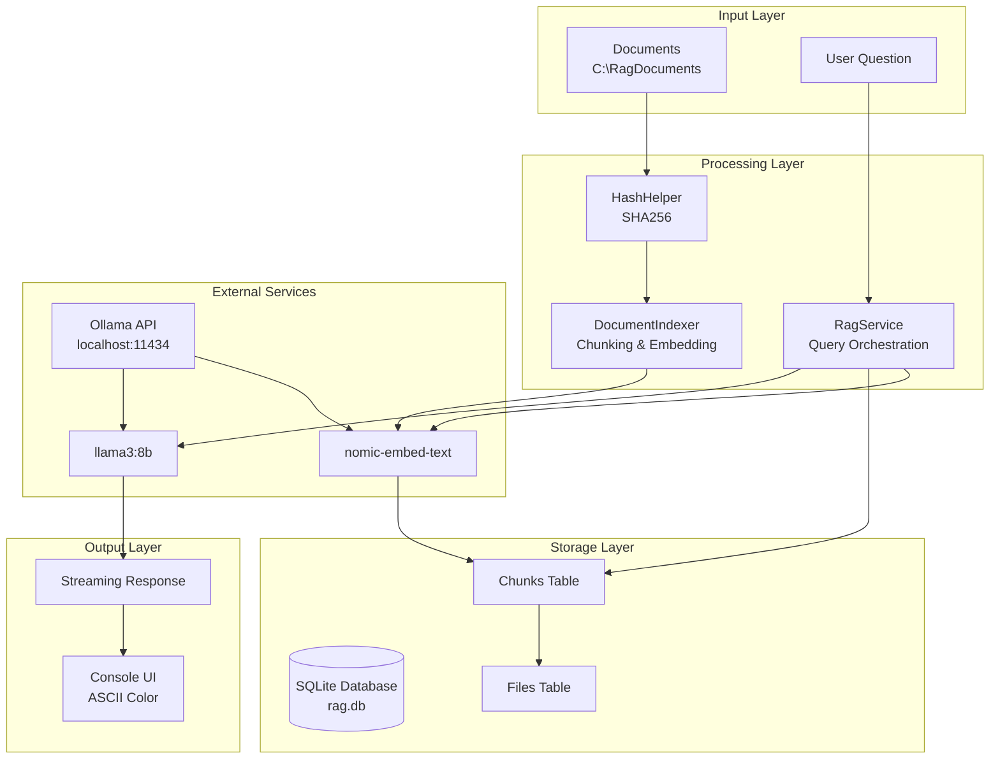
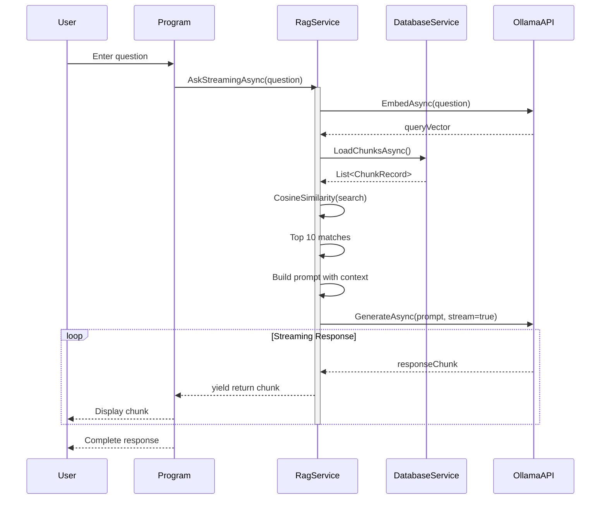
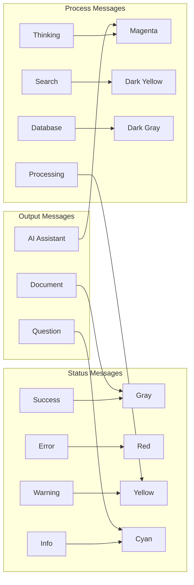
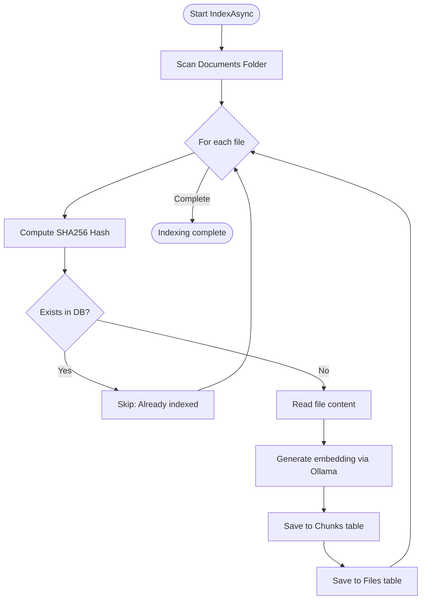
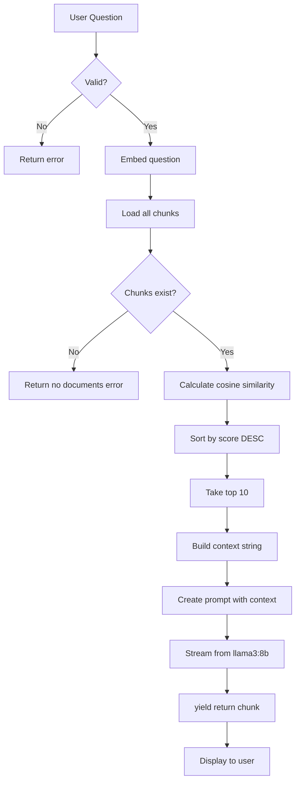
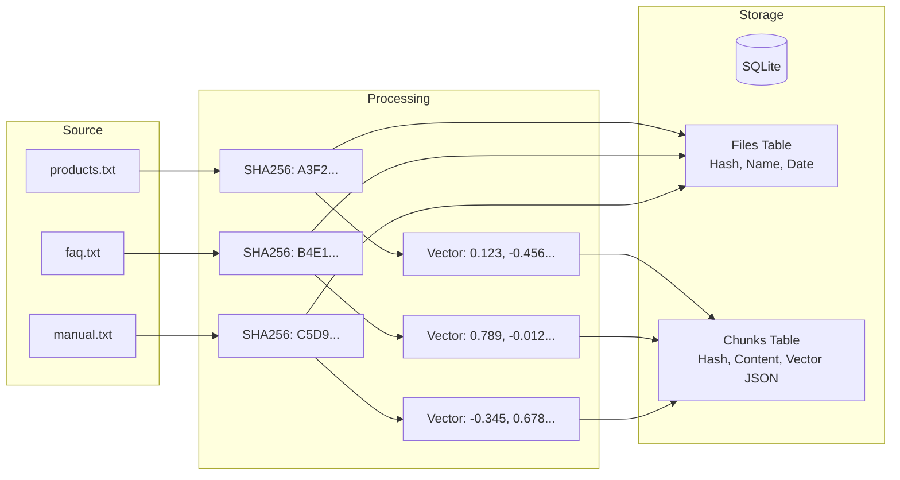
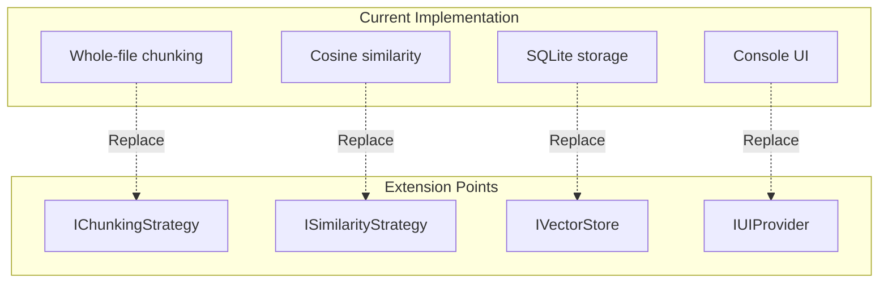

# OllamaSharp RAG SQLite - Technical Documentation

## Technical Architecture Document

**Version**: 1.0  
**Target Framework**: .NET 9.0  
**Language**: C# 13  
**Last Updated**: 2026-06-03

---

## Table of Contents

1. [System Overview](#system-overview)
2. [Architecture](#architecture)
3. [Component Details](#component-details)
4. [Data Flow](#data-flow)
5. [Database Schema](#database-schema)
6. [Algorithms](#algorithms)
7. [API Reference](#api-reference)
8. [Configuration](#configuration)
9. [Performance Characteristics](#performance-characteristics)
10. [Error Handling](#error-handling)
11. [Security Considerations](#security-considerations)
12. [Extensibility Points](#extensibility-points)

---

## System Overview

OllamaSharp RAG SQLite is a local-first Retrieval-Augmented Generation system that combines vector similarity search with large language models. The system eliminates external dependencies by using SQLite for vector storage and Ollama for both embeddings and text generation.

### Key Characteristics

| Property | Value |
|----------|-------|
| Deployment Model | Local-only |
| Vector Storage | SQLite (JSON serialized) |
| Search Algorithm | Brute-force Cosine Similarity |
| Embedding Dimension | 768 (nomic-embed-text) |
| Context Window | ~7000 characters |
| Chunking Strategy | Whole-file (pluggable) |

---

## Architecture

### High-Level Architecture



### Component Interaction Diagram



---

## Component Details

### 1. Program.cs (Entry Point)

**Responsibilities**:
- Console lifecycle management
- Command parsing (exit, help, stats)
- ASCII UI rendering
- Streaming output handling

**Key Methods**:

| Method | Description |
|--------|-------------|
| `Main()` | Application entry, initializes services, main loop |
| `DisplayHelp()` | Shows available commands |
| `DisplayStats()` | Retrieves and displays system statistics |

**Console Encoding**:
```csharp
Console.OutputEncoding = Encoding.ASCII;
Console.InputEncoding = Encoding.ASCII;
```

### 2. ColorHelper.cs (UI Utilities)

**Responsibilities**:
- ANSI color management
- ASCII divider generation
- Table formatting
- Animated spinners (thinking, loading)

**Key Methods**:

| Method | Output | Purpose |
|--------|--------|---------|
| `WriteDivider(char, int)` | `--------` | Section separation |
| `WriteMessage(MessageType, string)` | `[OK] Message` | Typed message with color |
| `WriteTable(Dictionary)` | Formatted table | Statistics display |
| `WriteBanner(string[])` | `* Banner *` | Application header |

**Message Types & Colors**:



### 3. HashHelper.cs (File Hashing)

**Responsibilities**:
- SHA256 hash computation
- File integrity verification

**Implementation**:
```csharp
public static string GetFileHash(string filePath)
{
    using var sha256 = SHA256.Create();
    using var stream = File.OpenRead(filePath);
    byte[] hash = sha256.ComputeHash(stream);
    return Convert.ToHexString(hash);  // Returns 64-character hex string
}
```

### 4. DatabaseService.cs (SQLite Operations)

**Responsibilities**:
- Database initialization
- CRUD operations for Files and Chunks
- Statistics queries

**Connection String**: `Data Source=rag.db`

**Core Methods**:

| Method | SQL Operation | Purpose |
|--------|---------------|---------|
| `InitializeAsync()` | CREATE TABLE IF NOT EXISTS | Schema setup |
| `FileExistsAsync(string hash)` | SELECT COUNT(*) | Duplicate detection |
| `SaveFileAsync(string, string)` | INSERT INTO Files | Track indexed files |
| `SaveChunkAsync(ChunkRecord)` | INSERT INTO Chunks | Store chunk + vector |
| `LoadChunksAsync()` | SELECT * FROM Chunks | Load all for search |
| `GetChunkCountAsync()` | SELECT COUNT(*) | Statistics |
| `GetDocumentCountAsync()` | SELECT COUNT(*) | Statistics |

**Vector Storage Strategy**:
```csharp
// Embedding stored as JSON string
command.Parameters.AddWithValue("$embedding", 
    JsonSerializer.Serialize(chunk.Embedding));

// Retrieval deserialization
Embedding = JsonSerializer.Deserialize<float[]>(reader.GetString(5))
    ?? Array.Empty<float>()
```

### 5. DocumentIndexer.cs (Indexing Pipeline)

**Responsibilities**:
- Document discovery
- Change detection via hash
- Embedding generation

**Configuration**:
```csharp
private const string DocumentsFolder = @"C:\RagDocuments";
private readonly OllamaApiClient _embedder;  // Model: "nomic-embed-text"
```

**Indexing Flow**:



### 6. RagService.cs (RAG Orchestration)

**Responsibilities**:
- Query embedding generation
- Similarity search execution
- Prompt engineering
- Response streaming

**Core Dependencies**:
```csharp
private readonly DatabaseService _database;     // Data access
private readonly DocumentIndexer _indexer;      // Indexing (initialization)
private readonly OllamaApiClient _llm;          // llama3:8b
private readonly OllamaApiClient _embedder;     // nomic-embed-text
```

**Query Processing Pipeline**:



**Prompt Template**:
```
You are a helpful assistant.

Answer ONLY using the supplied context.

If the answer cannot be found in the context,
say "I could not find that information."

Context:
{context}

Question:
{question}

Answer:
```

---

## Data Flow

### Indexing Data Flow



### Query Data Flow

```mermaid
flowchart LR
    Q[Question:<br/>"What products?"]
    
    subgraph Vectorization
        QV[Query Vector<br/>0.234, -0.567...]
    end
    
    subgraph Similarity
        S1[0.89 - products.txt]
        S2[0.76 - faq.txt]
        S3[0.45 - manual.txt]
    end
    
    subgraph Context
        CTX["Products: A, B, C<br/>FAQ: Pricing info..."]
    end
    
    subgraph Generation
        PR[Prompt + Context]
        RES["Answer: We sell A, B, C..."]
    end
    
    Q --> QV
    QV --> S1
    QV --> S2
    QV --> S3
    
    S1 --> CTX
    S2 --> CTX
    
    CTX --> PR --> RES
```

---

## Database Schema

### Entity Relationship Diagram


### Detailed Schema

**Files Table**:
```sql
CREATE TABLE Files (
    Id INTEGER PRIMARY KEY AUTOINCREMENT,
    FileName TEXT NOT NULL,
    FileHash TEXT NOT NULL UNIQUE,
    IndexedAt TEXT NOT NULL
);

-- Indexes
CREATE INDEX idx_files_hash ON Files(FileHash);
CREATE INDEX idx_files_indexed ON Files(IndexedAt);
```

**Chunks Table**:
```sql
CREATE TABLE Chunks (
    Id INTEGER PRIMARY KEY AUTOINCREMENT,
    FileHash TEXT NOT NULL,
    FileName TEXT NOT NULL,
    ChunkIndex INTEGER NOT NULL,
    Content TEXT NOT NULL,
    Embedding TEXT NOT NULL
);

-- Indexes
CREATE INDEX idx_chunks_hash ON Chunks(FileHash);
CREATE INDEX idx_chunks_filename ON Chunks(FileName);
```

**Sample Data**:
```json
// Files row
{
  "Id": 1,
  "FileName": "products.txt",
  "FileHash": "A3F2C1B8E9D4F6A2B1C3D4E5F6A7B8C9D0E1F2A3B4C5D6E7F8A9B0C1D2E3F4",
  "IndexedAt": "2026-06-03T14:30:22.123456Z"
}

// Chunks row
{
  "Id": 1,
  "FileHash": "A3F2C1B8E9D4F6A2B1C3D4E5F6A7B8C9D0E1F2A3B4C5D6E7F8A9B0C1D2E3F4",
  "FileName": "products.txt",
  "ChunkIndex": 0,
  "Content": "Our company sells three main products...",
  "Embedding": "[0.123, -0.456, 0.789, -0.012, ...]"  // 768 floats
}
```

---

## Algorithms

### Cosine Similarity

**Formula**:
```
similarity = (A · B) / (||A|| × ||B||)

Where:
A · B = Σ(aᵢ × bᵢ)
||A|| = √Σ(aᵢ²)
||B|| = √Σ(bᵢ²)
```

**Implementation**:
```csharp
private static double CosineSimilarity(float[] a, float[] b)
{
    double dot = 0, magA = 0, magB = 0;
    
    for (int i = 0; i < a.Length; i++)
    {
        dot += a[i] * b[i];
        magA += a[i] * a[i];
        magB += b[i] * b[i];
    }
    
    if (magA == 0 || magB == 0)
        return 0;
    
    return dot / (Math.Sqrt(magA) * Math.Sqrt(magB));
}
```

**Complexity**: O(n) where n = vector dimensions (768)

**Output Range**: -1.0 to 1.0  
- **1.0**: Identical vectors  
- **0.0**: Orthogonal (no relation)  
- **-1.0**: Opposite directions

### SHA256 Hashing

**Purpose**: File identity and change detection

**Characteristics**:
- 256-bit output (64 hex characters)
- Deterministic (same file → same hash)
- Collision-resistant

**Implementation**:
```csharp
using var sha256 = SHA256.Create();
using var stream = File.OpenRead(filePath);
byte[] hash = sha256.ComputeHash(stream);
return Convert.ToHexString(hash);
```

---

## API Reference

### Ollama API Integration

**Embeddings Endpoint**:
```
POST http://localhost:11434/api/embed
Content-Type: application/json

{
  "model": "nomic-embed-text",
  "input": ["Your text here..."]
}
```

**Response**:
```json
{
  "embeddings": [
    [0.123, -0.456, 0.789, ...]  // 768 floats
  ]
}
```

**Generate Endpoint** (Streaming):
```
POST http://localhost:11434/api/generate
Content-Type: application/json

{
  "model": "llama3:8b",
  "prompt": "Your prompt here...",
  "stream": true
}
```

**Streaming Response** (SSE format):
```
data: {"response": "Hello", "done": false}

data: {"response": " world", "done": false}

data: {"response": "", "done": true}
```

### OllamaSharp API Usage

```csharp
// Embedding generation
var embedResponse = await _embedder.EmbedAsync(new EmbedRequest
{
    Model = "nomic-embed-text",
    Input = new List<string> { text }
});
float[] vector = embedResponse.Embeddings[0].ToArray();

// Streaming generation
await foreach (var chunk in _llm.GenerateAsync(new GenerateRequest
{
    Model = "llama3:8b",
    Prompt = prompt,
    Stream = true
}))
{
    Console.Write(chunk.Response);
}
```

---

## Configuration

### Application Configuration

| Parameter | Location | Default | Description |
|-----------|----------|---------|-------------|
| DocumentsFolder | DocumentIndexer.cs | `C:\RagDocuments` | Source document directory |
| DatabaseFile | DatabaseService.cs | `rag.db` | SQLite database file |
| OllamaEndpoint | RagService.cs | `http://localhost:11434` | Ollama API endpoint |
| LLMModel | RagService.cs | `llama3:8b` | Generation model |
| EmbeddingModel | RagService.cs | `nomic-embed-text` | Embedding model |
| MaxContextLength | RagService.cs | `7000` | Characters for context |
| TopK | RagService.cs | `10` | Number of chunks retrieved |

### Modifiable Parameters

**Change Document Path**:
```csharp
// DocumentIndexer.cs, line 10
private const string DocumentsFolder = @"D:\MyDocuments";
```

**Adjust Context Window**:
```csharp
// RagService.cs, ExecuteStreamingQuery() method
if (contextBuilder.Length > 5000)  // Change from 7000
```

**Modify Retrieval Count**:
```csharp
// RagService.cs, ExecuteStreamingQuery() method
.Take(5)  // Change from 10
```

**Switch Models**:
```csharp
// RagService.cs, constructor
_llm = new OllamaApiClient(uri, "mistral");           // Different LLM
_embedder = new OllamaApiClient(uri, "all-minilm");  // Different embeddings
```

---

## Performance Characteristics

### Time Complexities

| Operation | Complexity | Typical Time (First Run) | Typical Time (Cached) |
|-----------|------------|--------------------------|----------------------|
| File hashing | O(file size) | ~10ms/MB | N/A |
| Embedding generation | O(text length × 768) | ~500ms/doc | ~50ms/doc (cached) |
| Similarity search | O(chunks × 768) | ~100ms for 1000 chunks | Same |
| LLM generation | O(output tokens) | ~2-5 sec/response | Same |

### Space Complexity

| Storage | Size Estimate | Calculation |
|---------|---------------|-------------|
| Vector storage | ~3KB per chunk | 768 floats × 4 bytes + JSON overhead |
| Text storage | ~1KB per chunk | Original text |
| File metadata | ~200 bytes per file | Hash + name + timestamp |

**Example**: 1000 chunks → ~4MB for vectors + ~1MB for text = ~5MB total

### Bottlenecks

```mermaid
flowchart LR
    subgraph Bottleneck["Primary Bottleneck"]
        O[Ollama API<br/>Local inference]
    end
    
    subgraph Secondary["Secondary Bottlenecks"]
        D[Disk I/O<br/>SQLite reads]
        S[Similarity Search<br/>O(n) scan]
        M[Memory<br/>All chunks loaded]
    end
    
    O -->|Slowest| B[Overall Response Time]
    D --> B
    S --> B
    M --> B
```

### Optimization Opportunities

| Area | Current | Optimized | Implementation |
|------|---------|-----------|----------------|
| Search | O(n) scan | O(log n) | SQLite vector extension |
| Memory | All chunks | Streaming | Paginated loading |
| Caching | None | Embedding cache | Dictionary cache |
| Parallelism | Sequential | Parallel | `Parallel.ForEach` for indexing |

---

## Error Handling

### Error Types & Recovery

```mermaid
flowchart TD
    E[Error Occurred] --> TYPE{Error Type}
    
    TYPE -->|Ollama Connection| O1[Log error]
    O1 --> O2[Display: [ERR] Connection failed]
    O2 --> O3[Stats show [OFFLINE]]
    O3 --> O4[Continue - use cached data]
    
    TYPE -->|File Not Found| F1[Log warning]
    F1 --> F2[Display: [WARN] Skipping file]
    F2 --> F3[Continue with next file]
    
    TYPE -->|Database Locked| D1[Log error]
    D1 --> D2[Display: [ERR] DB locked]
    D2 --> D3[Exit or retry?]
    
    TYPE -->|Invalid Question| Q1[Log info]
    Q1 --> Q2[Display: Please enter valid question]
    Q2 --> Q3[Return to prompt]
    
    TYPE -->|Model Not Found| M1[Log error]
    M1 --> M2[Display: Pull model first]
    M2 --> M3[Exit]
```

### Exception Handling Pattern

```csharp
try
{
    // Operation
}
catch (SqliteException ex) when (ex.SqliteErrorCode == 5)
{
    // Database locked
    ColorHelper.WriteError("Database is locked. Close other connections.");
}
catch (HttpRequestException ex)
{
    // Ollama connection failed
    ColorHelper.WriteError($"Cannot connect to Ollama: {ex.Message}");
}
catch (FileNotFoundException ex)
{
    // Document missing
    ColorHelper.WriteWarning($"File not found: {ex.FileName}");
}
catch (Exception ex)
{
    // General error
    ColorHelper.WriteError($"Unexpected error: {ex.Message}");
#if DEBUG
    ColorHelper.WriteColoredMessage(ex.ToString(), ConsoleColor.DarkRed);
#endif
}
```

---

## Security Considerations

### Local-First Architecture

| Aspect | Implementation | Risk Level |
|--------|----------------|------------|
| Data transmission | Localhost only | None |
| API authentication | None (local) | Low |
| File access | User context | Medium |
| Database encryption | None | Low (local) |

### Recommended Hardening

**For Production Use**:
```csharp
// Add SQLite encryption
using (var connection = new SqliteConnection("Data Source=rag.db;Password=secret"))
{
    connection.Open();
    connection.Execute("PRAGMA key = 'your-key';");
}

// Validate file paths
if (!Path.GetFullPath(file).StartsWith(DocumentsFolder))
{
    throw new SecurityException("Path traversal detected");
}

// Sanitize user input
var sanitized = question.Replace("--", "").Replace(";", "");
```

---

## Extensibility Points

### Pluggable Components



### Interface Definitions

**Chunking Strategy**:
```csharp
public interface IChunkingStrategy
{
    IEnumerable<string> Chunk(string text, int maxChunkSize);
}

// Example implementations:
// - SemanticChunking: Split by paragraphs
// - FixedSizeChunking: Current implementation
// - SentenceChunking: Split by sentences
```

**Similarity Strategy**:
```csharp
public interface ISimilarityStrategy
{
    double Calculate(float[] a, float[] b);
}

// Example implementations:
// - CosineSimilarity: Current
// - DotProductSimilarity: Alternative
// - EuclideanDistance: For certain embeddings
```

**Vector Store**:
```csharp
public interface IVectorStore
{
    Task SaveAsync(string id, float[] vector, string metadata);
    Task<List<(float[] Vector, string Metadata)>> SearchAsync(float[] query, int k);
}

// Example implementations:
// - SQLiteVectorStore: Current
// - PostgreSQLVectorStore: Production
// - InMemoryVectorStore: Testing
```

### Adding New Document Types

```csharp
// Extend DocumentIndexer
public async Task IndexPdfAsync(string pdfPath)
{
    var text = ExtractPdfText(pdfPath);  // Add PDF library
    // Rest of indexing pipeline same
}

// Register supported extensions
private readonly HashSet<string> _supportedExtensions = new()
{
    ".txt", ".json", ".pdf", ".docx"  // Add new extensions
};
```

---

## Deployment Checklist

- [ ] .NET 9 SDK installed
- [ ] Ollama installed and running
- [ ] `llama3:8b` model pulled
- [ ] `nomic-embed-text` model pulled
- [ ] `C:\RagDocuments` folder created
- [ ] Sample documents added
- [ ] Port 11434 available (Ollama)
- [ ] Write permissions in app directory (for SQLite)

---

## Troubleshooting Matrix

| Symptom | Likely Cause | Diagnostic | Solution |
|---------|--------------|------------|----------|
| "No connection" | Ollama not running | `curl localhost:11434` | `ollama serve` |
| "Model not found" | Model not pulled | `ollama list` | `ollama pull [model]` |
| Slow first query | Generating embeddings | Check CPU usage | Normal, wait |
| Database locked | Another process using SQLite | Check for open connections | Close SQLite browsers |
| No results found | Empty document folder | Check `C:\RagDocuments` | Add documents |
| Encoding errors | Unicode in console | `Console.OutputEncoding` | Set to ASCII or Unicode |

---

## Version History

| Version | Date | Changes |
|---------|------|---------|
| 1.0 | 2026-06-03 | Initial release with SQLite storage, ASCII UI, streaming responses |

---

## Appendix A: Ollama Model Specifications

### llama3:8b
- **Parameters**: 8 billion
- **Context length**: 8192 tokens
- **Training**: Meta Llama 3
- **Use case**: Text generation

### nomic-embed-text
- **Parameters**: 137 million
- **Output dimension**: 768
- **Training**: Nomic AI
- **Use case**: Text embeddings

---

## Appendix B: Glossary

| Term | Definition |
|------|------------|
| **RAG** | Retrieval-Augmented Generation - combining search with LLMs |
| **Embedding** | Numerical vector representation of text |
| **Cosine Similarity** | Measure of angle between two vectors |
| **Chunk** | Segment of a document for embedding |
| **Context Window** | Maximum tokens LLM can process |
| **Vector Store** | Database optimized for vector search |
| **SHA256** | Cryptographic hash function |

---

## Appendix C: Useful SQL Queries

```sql
-- View indexed files
SELECT FileName, IndexedAt FROM Files ORDER BY IndexedAt DESC;

-- Count chunks per file
SELECT FileName, COUNT(*) as ChunkCount 
FROM Chunks 
GROUP BY FileName 
ORDER BY ChunkCount DESC;

-- Find recently added documents
SELECT FileName, IndexedAt 
FROM Files 
WHERE IndexedAt > datetime('now', '-7 days');

-- Database size
SELECT page_count * page_size as Size 
FROM pragma_page_count(), pragma_page_size();
```

---